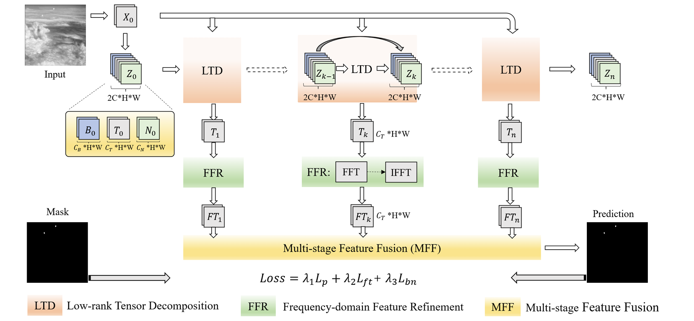
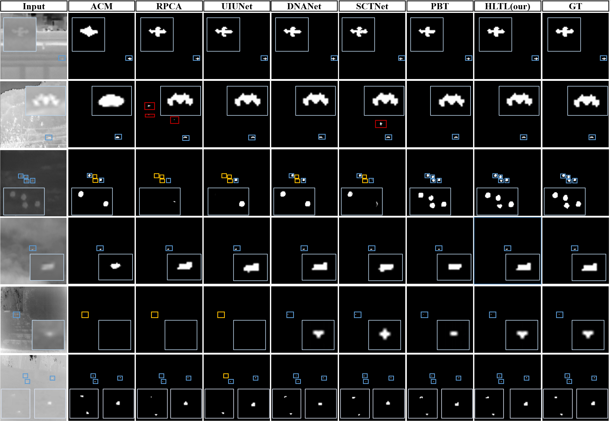

# HLTLNet : Hierarchical Low-Rank Tensor Learning with Frequency-Domain Refinement for InfraredSmall Target Detection
## Requirements
- **Python 3.8**
- **pytorch 2.7**
- **numpy, PIL, tqdcm, shutil**
<br><br>
## Introduction
The main contributions of this paper
1. A hierarchical framework is proposed to address the challenges of target-background and target-noise separation in
 IRSTD.
<br><br>
2. Supervised low-rank tensor learning is introduced for the coarse separation stage, enhancing model interpretability by
 providing explicit component subspaces.
<br><br>
3. A frequency-domainrefinementmoduleisdesignedtopurifythesparsetargetrepresentation, effectively distinguishing
 true targets from residual noise.
<br><br>

## Structure

## Usage
**We used the NUDT-SIRST, NUAA-SIRST,IRSTD-1K for both training and test.** 
**All images were uniformly resized to 256×256 pixels.** 

#### 1.data
* **Our dataset has the following structure:**
  ```
  ├──./datasets/
  │    ├── NUDT
  │    │    ├── images
  │    │    │    ├── 000001.png
  │    │    │    ├── 000002.png
  │    │    │    ├── ...
  │    │    ├── masks
  │    │    │    ├── 000001.png
  │    │    │    ├── 000002.png
  │    │    │    ├── ...
  │    │    ├── img_idx
  │    │    │    ├── train_NUDT.txt
  │    │    │    ├── test_NUDT.txt
  │    ├── NUAA
  │    │    ├── images
  │    │    │    ├── Misc_1.png
  │    │    │    ├── Misc_2.png
  │    │    │    ├── ...
  │    │    ├── masks
  │    │    │    ├── Misc_1.png
  │    │    │    ├── Misc_2.png
  │    │    │    ├── ...
  │    │    ├── img_idx
  │    │    │    ├── train_NUAA.txt
  │    │    │    ├── test_NUAA.txt
  │    ├── IRSTD
  │    │    ├── images
  │    │    │    ├── XDU0.png
  │    │    │    ├── XDU1.png
  │    │    │    ├── ...
  │    │    ├── masks
  │    │    │    ├── XDU0.png
  │    │    │    ├── XDU1.png
  │    │    │    ├── ...
  │    │    ├── img_idx
  │    │    │    ├── train_IRSTD.txt
  │    │    │    ├── test_IRSTD.txt
  │    ├── ...  
  ```
##### 2.Train.
```bash
python train.py
```

#### 3.Test.
```bash
python test.py
```

## Results and Trained Models
#### Qualitative Results


#### Quantitative Results on  NUDT-SIRST, NUAA-SIRST,and IRSTD-1K

| Model            | mIoU (x10(-2)) | Pd (x10(-2)) | Fa (x10(-6)) |
|------------------|:--------------:|:------------:|:------------:|
| NUDT-SIRST       |     95.68      |    99.37     |     0.53     |
| NUAA-SIRST       |     79.24      |      1       |    10.47     |
| IRSTD-1K         |     68.94      |    93.49     |    8.199     |


*This overall repository style is highly borrowed from [IRSTD-Toolbox](https://github.com/XinyiYing/BasicIRSTD). Thanks to Xinyi Ying.

*This code is highly borrowed from [LRRNet](https://github.com/hli1221/imagefusion-LRRNet). Thanks to Hui Li.

*This code is highly borrowed from [GEFPN](https://github.com/xiyunqiao/irst3). Thanks to yunqiao xi.


Citation
If you find the code useful, please consider citing our paper using the following BibTeX entry.
```
@article{qi2026hierarchical,
  title={Hierarchical low-rank tensor learning with frequency-domain refinement for infrared small-target detection},
  author={Qi, Meibin and Zhu, Zijian and Zhuang, Shuo and Zhu, Liangliang and Li, Xiaohong and Li, Kunyuan},
  journal={Infrared Physics \& Technology},
  pages={106406},
  year={2026},
  publisher={Elsevier}
}
```


